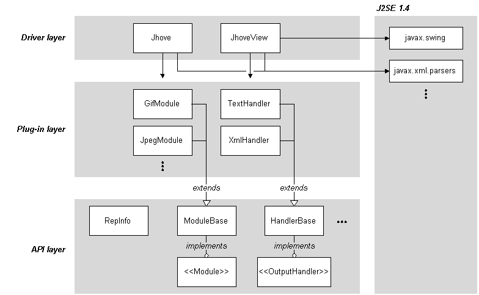

# Architecture

JHOVE is designed as a layered architecture with an API (with well-defined, public interfaces) invoked by a thin application layer for a stand-alone, command line tool, applicable for batch and interactive operation. The API can be used on its own to create other compatible tools.

