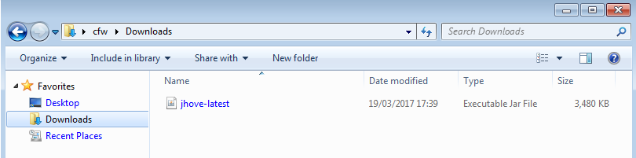
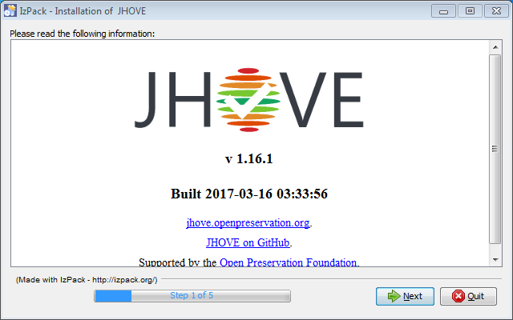
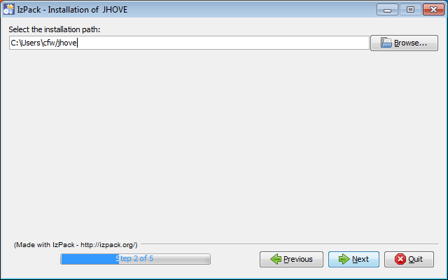
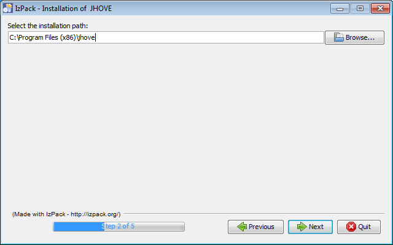
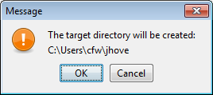
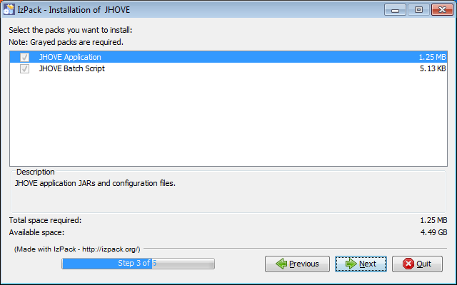
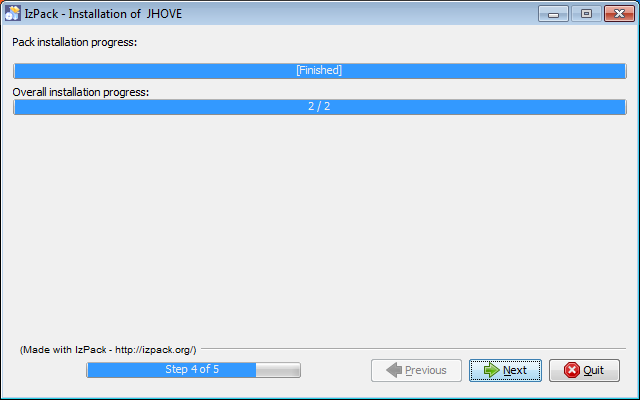
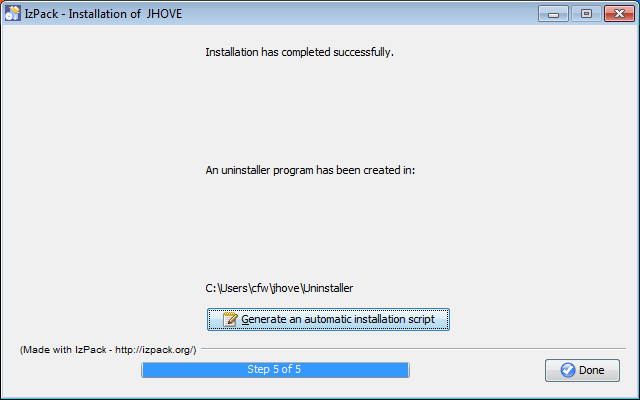
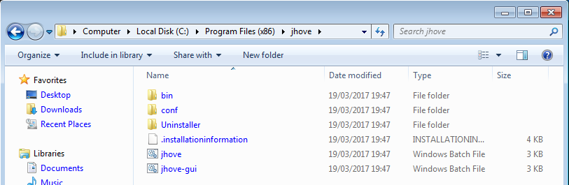
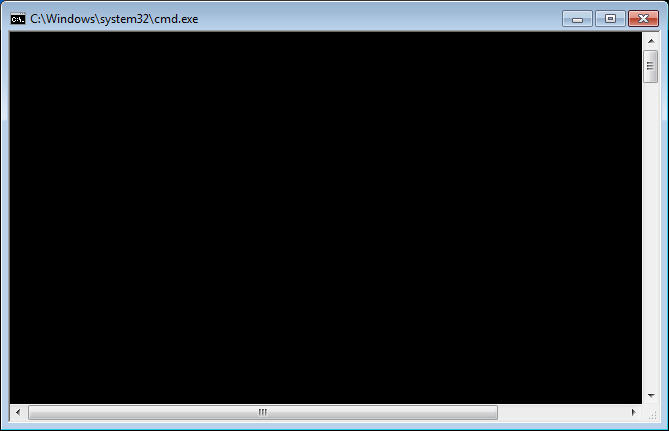

# {{ page.title }}

JHOVE is an open source file format identification, validation and characterisation tool. Format identification and validation are essential first steps in digital preservation workflows. This guide assists newcomers to JHOVE (pronounced 'jove') with installation of the software and using the graphical user interface (GUI).

{: #getting-jhove .section-heading}
## Getting JHOVE

### From the Open Preservation web site

1. You can find out more about JHOVE and download the latest installer from the Open Preservation Foundation (OPF) JHOVE product page : [http://openpreservation.org/technology/products/jhove/](http://openpreservation.org/technology/products/jhove/).

2. Press the "Download JHOVE" button :  

### From the JHOVE web site

1. There is also a dedicated JHOVE website where you can find user documentation, developer information and download JHOVE : [http://jhove.openpreservation.org/](http://jhove.openpreservation.org/).

2. Again, press the "Download JHOVE" button :  

{: #installing-jhove .section-heading}
### Installing JHOVE

1. This will start to download the file `jhove-latest.jar` into the location where you download your files, such as your Downloads folder:  

2. Once the download has finished double click the file, which will open the installer window, select next:  

3. This will open up the following window, where you need to set the location for where you will install JHOVE:  

4. You can change the installation path if you want to by selecting the browse button or typing a new path in the dialog:  

5. You'll see a pop-up dialog confirming that the folder will be created or overwritten if it already existed, select OK to continue:  

6. Next you'll see a screen that indicates which components will be installed, click next to install JHOVE:  

7. Once the install dialog is finished then click next:  

8. If everything has completed properly you'll see a screen reporting successful installation, click the "Done" button to complete installation:  

### Running JHOVE on a Windows PC

1. Then navigate to the folder where you have installed JHOVE e.g: C:\Program Files (x86)\jhove and double click the `jhove-gui.bat` file:  

2. This will first open a black command window, `cmd.exe`:  
  
Leave this window, if you close it you'll stop the GUI process.

3. The JHOVE GUI window should start:  
  

4. If this software does not open then you may not have Java installed on your computer, or you may have an incompatible version of Java installed on your computer. (Please go to the section ‘Installing Java on a PC’ for help.)

5. You can check what metadata extractors (HUL modules) are installed by selecting the ‘Help’ menu and  ‘About JHOVE’.

6. This will open a new window. JHOVE works by incorporating different ‘HUL’ modules that extract metadata from different types of files. Each of the HUL modules represents a different set of common file types (e.g. PDFs) that it can extract metadata from.
